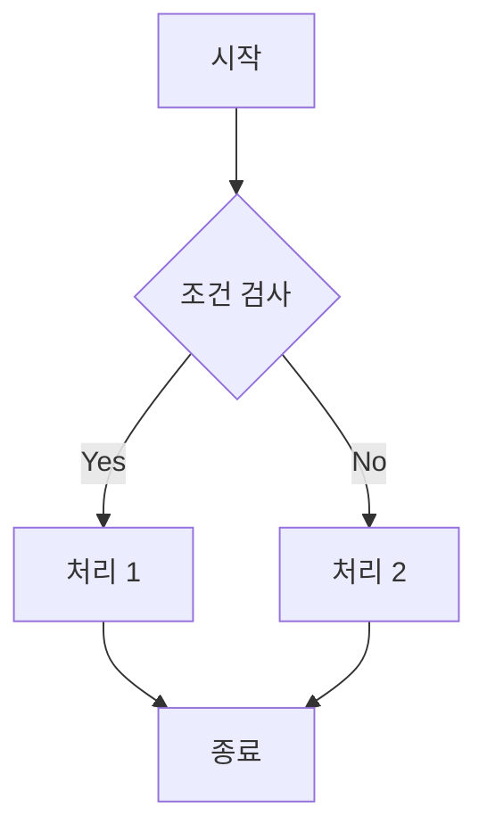
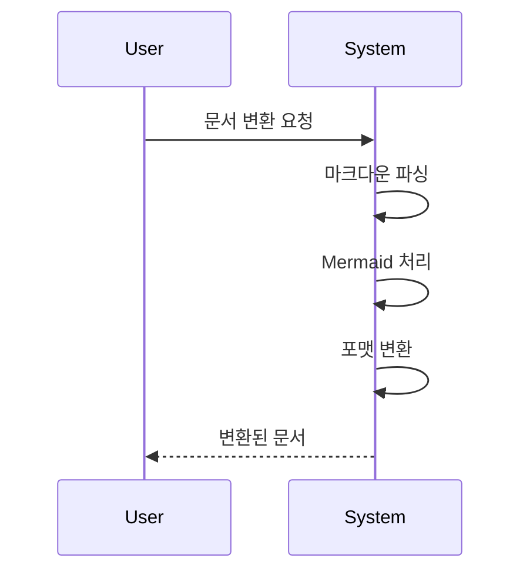
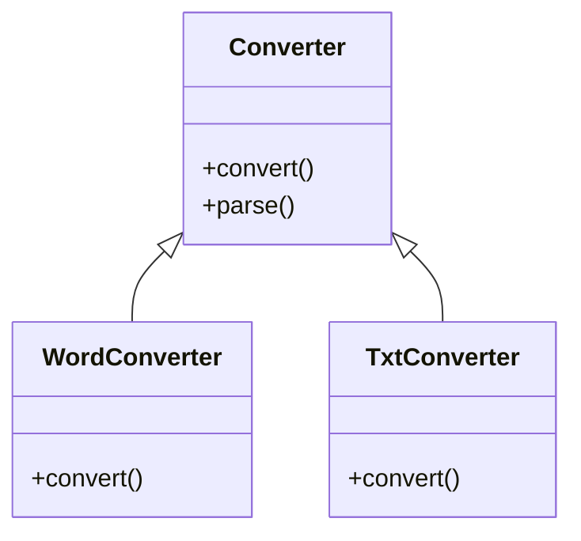

# Markdown 변환 테스트 문서

이 문서는 모든 마크다운 기능을 테스트하기 위한 샘플 문서입니다.

## 1. 텍스트 서식

**굵은 글씨**와 *기울임체*, ~~취소선~~, `인라인 코드`를 테스트합니다.

## 2. 제목 레벨

### 3단계 제목
#### 4단계 제목
##### 5단계 제목
###### 6단계 제목

## 3. 목록

### 순서 있는 목록
1. 첫 번째 항목
2. 두 번째 항목
   1. 중첩된 항목 1
   2. 중첩된 항목 2
3. 세 번째 항목

### 순서 없는 목록
- 항목 1
  - 중첩 항목 1
  - 중첩 항목 2
    - 더 깊은 중첩
- 항목 2
- 항목 3

## 4. 인용문

> 첫 번째 레벨 인용문
>> 두 번째 레벨 인용문
>>> 세 번째 레벨 인용문

## 5. 코드 블록

```python
def hello_world():
    print("Hello, World!")
```

```javascript
function calculateSum(a, b) {
    return a + b;
}
```

## 6. 표

| 제목 1 | 제목 2 | 제목 3 |
|--------|---------|---------|
| 내용 1 | 내용 2 | 내용 3 |
| 행 2-1 | 행 2-2 | 행 2-3 |
| 행 3-1 | 행 3-2 | 행 3-3 |

### 정렬이 있는 표

| 왼쪽 정렬 | 가운데 정렬 | 오른쪽 정렬 |
|:---------|:----------:|-----------:|
| 내용 1 | 내용 2 | 내용 3 |
| 더 긴 내용 | 더 긴 내용 | 더 긴 내용 |

## 7. 링크와 이미지

### 링크
[GitHub](https://github.com)
[상대경로 링크](../README.md)

### 이미지


## 8. 수평선

---

## 9. 체크리스트

- [x] 완료된 항목
- [ ] 미완료 항목
- [x] 또 다른 완료 항목

## 10. Mermaid 다이어그램

### 순서도


### 시퀀스 다이어그램


### 클래스 다이어그램


## 11. 각주

각주를 사용한 문장[^1]과 또 다른 각주[^2]

[^1]: 첫 번째 각주 설명
[^2]: 두 번째 각주 설명 